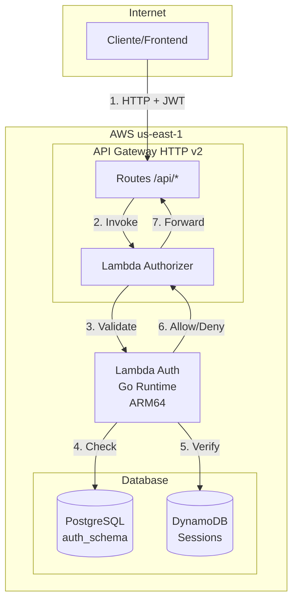
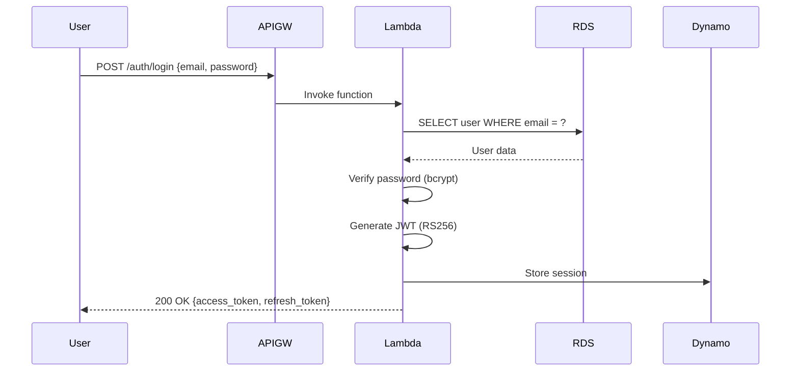
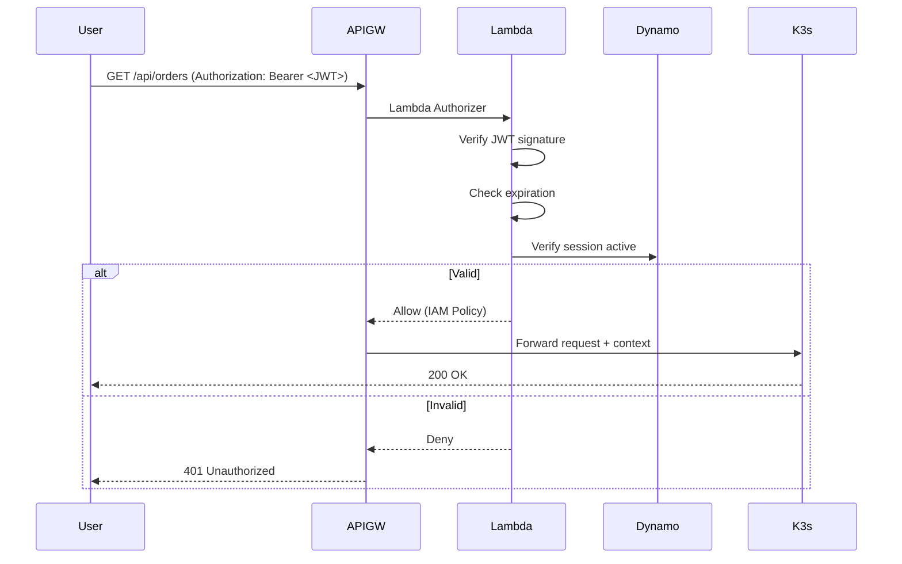

# Auth Lambda - Arquitetura e Documentação Técnica

> Serviço de Autenticação Serverless (Go + Lambda) - OficinaPro  
> **Última atualização:** 18 de Fevereiro de 2026

---

## 🎯 Visão Geral

O **Auth Lambda** é o serviço de autenticação serverless do OficinaPro, responsável por validar JWTs, gerenciar sessões e controlar acesso aos microserviços via API Gateway.

---

## 🏗️ Arquitetura AWS



---

## 🔄 Fluxo de Autenticação

### 1. Login (Geração de JWT)



### 2. Validação de Request



---

## 📋 Regras de Negócio

### RN001: Geração de JWT

**Algoritmo:** RS256 (RSA Signature)  
**Expiration:** 
- Access Token: 15 minutos
- Refresh Token: 7 dias

**Claims:**
```json
{
  "sub": "user-uuid",
  "email": "user@example.com",
  "roles": ["CUSTOMER", "OPERATOR"],
  "iat": 1708251234,
  "exp": 1708252134
}
```

### RN002: Password Policy

- Mínimo 8 caracteres
- 1 letra maiúscula
- 1 número
- 1 caractere especial
- Hash: bcrypt (cost 12)

### RN003: Session Management

**DynamoDB Session Schema:**
```json
{
  "PK": "SESSION#user-uuid",
  "SK": "SESSION#session-id",
  "accessToken": "jwt-token",
  "refreshToken": "refresh-token",
  "expiresAt": 1708338634,
  "ipAddress": "192.168.1.1",
  "userAgent": "Mozilla/5.0...",
  "ttl": 1708943434
}
```

**TTL:** Sessions expiram após 7 dias (DynamoDB TTL automático)

### RN004: Rate Limiting

**Login Attempts:**
- Máximo 5 tentativas por IP a cada 15 minutos
- Bloqueio temporário: 30 minutos
- Bloqueio permanente: após 20 tentativas em 1 hora

### RN005: Roles e Permissões

| Role | Permissões |
|------|-----------|
| **CUSTOMER** | Criar OS, visualizar próprias OS, fazer pagamentos |
| **OPERATOR** | Visualizar todas OS, aprovar OS, gerenciar billings |
| **MECHANIC** | Visualizar executions, atualizar status de trabalho |
| **ADMIN** | Acesso total |

---

## 💾 Modelo de Dados

### PostgreSQL: `auth_schema`

```sql
CREATE TABLE auth_schema.user (
    id UUID PRIMARY KEY DEFAULT gen_random_uuid(),
    email VARCHAR(255) NOT NULL UNIQUE,
    password_hash VARCHAR(255) NOT NULL,
    name VARCHAR(255) NOT NULL,
    roles TEXT[] NOT NULL,
    is_active BOOLEAN DEFAULT true,
    created_at TIMESTAMP DEFAULT CURRENT_TIMESTAMP,
    last_login_at TIMESTAMP
);

CREATE INDEX idx_user_email ON auth_schema.user(email);
```

### DynamoDB: `oficinapro-sessions`

**Primary Key:**
- PK: `SESSION#user-uuid`
- SK: `SESSION#session-id`

**GSI1:**
- PK: `USER#user-uuid`
- SK: `EXPIRES_AT#timestamp`

---

## 📊 Observabilidade

### CloudWatch Metrics

- `Invocations` (Lambda invocations count)
- `Duration` (execution time)
- `Errors` (failed invocations)
- `Throttles` (rate limit hits)

### Custom Metrics (via OTEL)

```go
meter.NewInt64Counter("auth.login.success")
meter.NewInt64Counter("auth.login.failed")
meter.NewInt64Histogram("auth.jwt.validation.duration")
```

### X-Ray Traces

Distributed tracing habilitado:
- API Gateway → Lambda → RDS
- API Gateway → Lambda → DynamoDB

---

## 🚀 Deployment

### Lambda Configuration

| Config | Value |
|--------|-------|
| **Runtime** | Go 1.x (custom runtime) |
| **Architecture** | ARM64 (Graviton2 - cost optimization) |
| **Memory** | 512 MB |
| **Timeout** | 30 segundos |
| **Concurrency** | 10 (reserved), 100 (burst) |
| **VPC** | Sim (acesso RDS) |

### CI/CD

**Arquivo:** `.github/workflows/deploy-lambda.yml`

**Steps:**
1. Build Go binary (`GOOS=linux GOARCH=arm64`)
2. Criar `bootstrap.zip` (custom runtime)
3. Upload para S3 ou inline (< 50MB)
4. Update Lambda function code via AWS CLI

**Secrets:**
- `AWS_ACCESS_KEY_ID` / `AWS_SECRET_ACCESS_KEY`
- `JWT_PRIVATE_KEY` (RSA private key para assinatura)
- `JWT_PUBLIC_KEY` (RSA public key para verificação)

### Environment Variables

```bash
DB_HOST=oficinapro-consolidated-db.cmz0ic48gh2u.us-east-1.rds.amazonaws.com
DB_PORT=5432
DB_NAME=auth_db
DB_USER=oficinapro_admin
DB_PASSWORD=${DB_PASSWORD}

DYNAMODB_TABLE=oficinapro-sessions
DYNAMODB_REGION=us-east-1

JWT_PRIVATE_KEY=${JWT_PRIVATE_KEY}
JWT_PUBLIC_KEY=${JWT_PUBLIC_KEY}
JWT_EXPIRATION=900
REFRESH_TOKEN_EXPIRATION=604800

NEW_RELIC_LICENSE_KEY=${NEW_RELIC_LICENSE_KEY}
OTEL_EXPORTER_OTLP_ENDPOINT=https://otlp.nr-data.net:4318
```

---

## 🔐 Segurança

### Secrets Management

- **JWT Keys**: Armazenados no AWS Secrets Manager
- **DB Credentials**: Parameter Store (SecureString)
- **Rotation**: JWT keys rotacionados a cada 90 dias

### Network Security

- Lambda em VPC privada
- Security Group: Apenas porta 5432 (RDS)
- NAT Gateway para acesso DynamoDB (VPC Endpoint)

### Encryption

- **At Rest**: RDS encryption, DynamoDB encryption
- **In Transit**: TLS 1.2+ (API Gateway, RDS)
- **JWT**: Signed with RS256 (asymmetric)

---

## 🧪 Testes

### Unit Tests

```bash
go test ./... -v -cover
```

### Integration Tests

```bash
go test ./internal/integration/... -tags=integration
```

### Load Tests (Artillery)

```yaml
config:
  target: https://api.oficinapro.com
  phases:
    - duration: 60
      arrivalRate: 100
scenarios:
  - name: "Login Flow"
    flow:
      - post:
          url: "/auth/login"
          json:
            email: "test@example.com"
            password: "Test@123"
```

---

## 📚 Recursos AWS

| Recurso | ARN/Nome |
|---------|----------|
| **Lambda Function** | `arn:aws:lambda:us-east-1:123456789012:function:oficinapro-auth` |
| **API Gateway** | `oficinapro-api-gateway` |
| **DynamoDB Table** | `oficinapro-sessions` |
| **RDS Instance** | `oficinapro-consolidated-db` |
| **CloudWatch Log Group** | `/aws/lambda/oficinapro-auth` |

---

**Autor:** OficinaPro Team  
**Versão:** 1.0.0  
**Lambda Size:** ~15MB (compressed)
