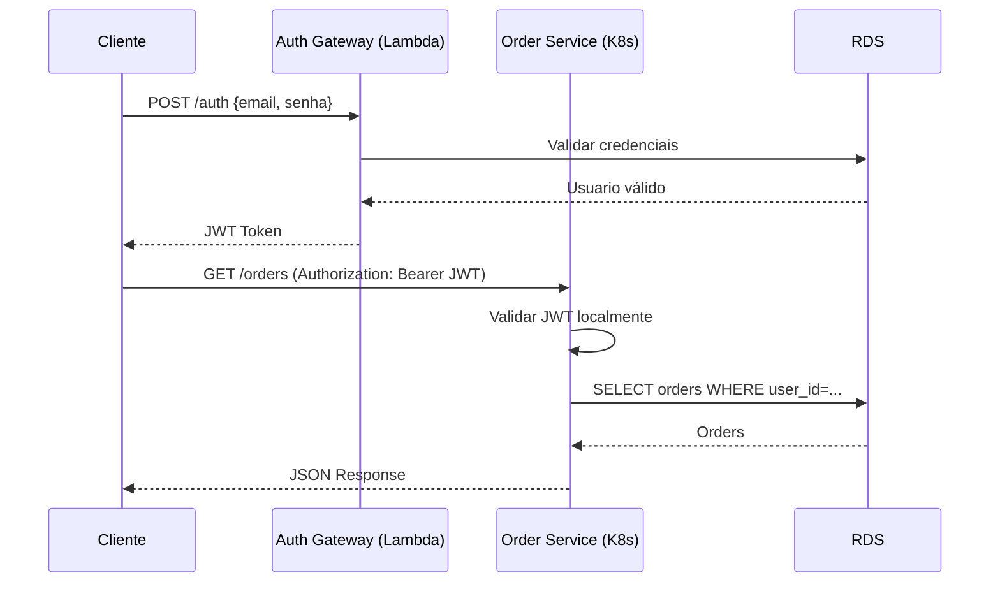

# Order Service - Exemplo de Serviço Kubernetes

Serviço de exemplo que roda em Kubernetes e valida JWT gerado pelo Auth Gateway (Lambda).

## 📋 Visão Geral

Este é um serviço Go simples que:
- Roda em Kubernetes (não Lambda)
- Valida JWT localmente (sem chamar Auth Gateway)
- Usa o mesmo JWT secret para validação
- Expõe endpoints REST
- Acessa o mesmo RDS PostgreSQL

## 🏗️ Arquitetura

```
Cliente → API Gateway (Lambda) → JWT Token
Cliente → Load Balancer (K8s) → Order Service
                                    ↓
                              Valida JWT localmente
                                    ↓
                              Acessa RDS
```

## 🚀 Estrutura

```
examples/order-service/
├── cmd/
│   └── api/
│       └── main.go           # Entrypoint
├── internal/
│   ├── handler/
│   │   ├── order_handler.go  # Handlers HTTP
│   │   └── middleware.go     # JWT validation middleware
│   ├── domain/
│   │   └── order.go          # Entidade Order
│   └── repository/
│       └── order_repository.go
├── Dockerfile                # Build container
├── go.mod
├── go.sum
└── README.md
```

## 🔐 Validação de JWT

O serviço valida JWT usando o **mesmo secret** do Auth Gateway:

```go
// Middleware valida JWT
func JWTMiddleware(jwtSecret string) func(http.Handler) http.Handler {
    return func(next http.Handler) http.Handler {
        return http.HandlerFunc(func(w http.ResponseWriter, r *http.Request) {
            // Extrair token do header Authorization
            authHeader := r.Header.Get("Authorization")

            // Validar token
            claims, err := validateJWT(authHeader, jwtSecret)
            if err != nil {
                http.Error(w, "Unauthorized", http.StatusUnauthorized)
                return
            }

            // Adicionar claims ao contexto
            ctx := context.WithValue(r.Context(), "user_id", claims["userId"])
            ctx = context.WithValue(ctx, "role", claims["role"])

            next.ServeHTTP(w, r.WithContext(ctx))
        })
    }
}
```

## 📊 Endpoints

| Método | Path | Descrição | Auth |
|--------|------|-----------|------|
| `GET` | `/health` | Health check | ❌ |
| `GET` | `/orders` | Listar pedidos do usuário | ✅ JWT |
| `POST` | `/orders` | Criar novo pedido | ✅ JWT |
| `GET` | `/orders/:id` | Obter pedido específico | ✅ JWT |

## 🔧 Configuração

### Variáveis de Ambiente

```bash
# Database
DB_HOST=postgres.xxxxx.rds.amazonaws.com
DB_PORT=5432
DB_NAME=oficinapro
DB_USER=oficinapro_app
DB_PASSWORD=secret  # Ou usar Secrets Manager

# JWT (MESMO SECRET DO AUTH GATEWAY)
JWT_SECRET=your-secret-key-min-32-chars-long
JWT_ISSUER=auth-oficinapro

# Application
PORT=8080
ENVIRONMENT=production
```

## 🐳 Docker

### Build
```bash
docker build -t order-service:latest .
```

### Run Local
```bash
docker run -p 8080:8080 \
  -e DB_HOST=localhost \
  -e DB_PORT=5432 \
  -e JWT_SECRET=your-secret \
  order-service:latest
```

## ☸️ Kubernetes

### ConfigMap (não-sensível)
```yaml
apiVersion: v1
kind: ConfigMap
metadata:
  name: order-service-config
data:
  DB_HOST: "postgres.xxxxx.rds.amazonaws.com"
  DB_PORT: "5432"
  DB_NAME: "oficinapro"
  JWT_ISSUER: "auth-oficinapro"
  PORT: "8080"
```

### Secret (sensível)
```yaml
apiVersion: v1
kind: Secret
metadata:
  name: order-service-secret
type: Opaque
stringData:
  DB_PASSWORD: "secret-password"
  JWT_SECRET: "your-secret-key-min-32-chars-long"
```

### Deployment
```yaml
apiVersion: apps/v1
kind: Deployment
metadata:
  name: order-service
spec:
  replicas: 3
  selector:
    matchLabels:
      app: order-service
  template:
    metadata:
      labels:
        app: order-service
    spec:
      containers:
      - name: order-service
        image: order-service:latest
        ports:
        - containerPort: 8080
        envFrom:
        - configMapRef:
            name: order-service-config
        - secretRef:
            name: order-service-secret
        resources:
          requests:
            memory: "128Mi"
            cpu: "100m"
          limits:
            memory: "256Mi"
            cpu: "200m"
        livenessProbe:
          httpGet:
            path: /health
            port: 8080
          initialDelaySeconds: 10
          periodSeconds: 10
        readinessProbe:
          httpGet:
            path: /health
            port: 8080
          initialDelaySeconds: 5
          periodSeconds: 5
```

## 🧪 Testes

### 1. Obter JWT do Auth Gateway
```bash
# Autenticar
TOKEN=$(curl -s -X POST https://api.oficinapro.com/auth \
  -H "Content-Type: application/json" \
  -d '{"email":"user@test.com","senha":"senha123"}' | jq -r '.token')
```

### 2. Chamar Order Service
```bash
# Listar pedidos (com JWT)
curl -H "Authorization: Bearer $TOKEN" \
  https://orders.oficinapro.com/orders
```

## 🔄 Fluxo Completo



## 📝 Notas Importantes

### JWT Secret DEVE ser o mesmo
- ✅ Auth Gateway gera JWT com secret A
- ✅ Order Service valida JWT com secret A
- ❌ Se forem diferentes, validação falha

### Como Garantir Mesmo Secret
1. **ConfigMap/Secret no K8s**: Criar secret com mesmo valor
2. **AWS Secrets Manager**: Ambos leem do mesmo secret
3. **SSM Parameter Store**: Ambos leem do mesmo parameter

### Segurança
- ⚠️ **NUNCA** commitar JWT_SECRET no código
- ⚠️ **NUNCA** logar JWT_SECRET
- ✅ Usar Kubernetes Secrets
- ✅ Rotacionar secrets periodicamente
- ✅ Usar RBAC para restringir acesso aos secrets

## 🚀 Deploy

### 1. Build e Push da Imagem
```bash
# Build
docker build -t my-registry/order-service:v1.0.0 .

# Push para ECR
aws ecr get-login-password --region us-east-1 | \
  docker login --username AWS --password-stdin 123456789.dkr.ecr.us-east-1.amazonaws.com

docker tag order-service:latest 123456789.dkr.ecr.us-east-1.amazonaws.com/order-service:v1.0.0
docker push 123456789.dkr.ecr.us-east-1.amazonaws.com/order-service:v1.0.0
```

### 2. Deploy no Kubernetes
```bash
# Criar namespace
kubectl create namespace oficinapro

# Criar secrets
kubectl create secret generic order-service-secret \
  --from-literal=JWT_SECRET="your-secret" \
  --from-literal=DB_PASSWORD="password" \
  -n oficinapro

# Deploy
kubectl apply -f k8s/ -n oficinapro

# Verificar
kubectl get pods -n oficinapro
kubectl logs -f deployment/order-service -n oficinapro
```

## 📚 Próximos Passos

1. **Adicionar mais serviços**: payment-service, customer-service, etc
2. **Service Mesh**: Istio para mTLS entre serviços
3. **Observability**: Prometheus + Grafana
4. **Tracing**: Jaeger ou AWS X-Ray
5. **Rate Limiting**: Por usuário/endpoint
6. **RBAC**: Validar roles no middleware (ADMIN vs USER)

---

**Veja também**:
- `k8s/order-service/` - Manifests Kubernetes completos
- `HYBRID_ARCHITECTURE_LAMBDA_K8S.md` - Arquitetura completa

